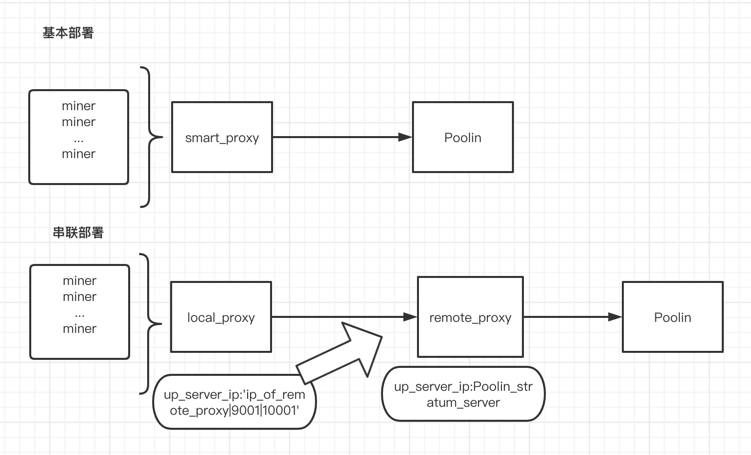

# Poolin Smart Agent Usage

## 币印新版智能代理特色:
- 外网网络连接降低至个位数

- 支持外网 ip 混淆, 约 10 分钟 - 1 小时切换一次 ip 地址

- 流量全加密

- 大幅缩减网络流量, 1 台矿机 vs 1 万台矿机, 下行流量几乎不变, 上行流量减少 85%

- 单台代理支撑 2w - 20w 矿机(依赖主机性能)

- 智能代理统一设置子账户(挖矿账户)

- 可设置钉钉报警通知,代理健康状况随时掌控

- 依据网络情况多样化部署
---

# Poolin Bitcoin 智能代理使用说明 (docker 方法运行)

## 1. 安装docker
|Platform|x86_64/amd64|ARM|ARM64/AARCH64|
|---|---|---|---|
|[CentOS](https://docs.docker.com/install/linux/docker-ce/centos/)|yes|no|yes|
|[Debian](https://docs.docker.com/install/linux/docker-ce/debian/)|yes|yes|yes|
|[Fedora](https://docs.docker.com/install/linux/docker-ce/fedora/)|yes|no|yes|
|[Ubuntu](https://docs.docker.com/install/linux/docker-ce/ubuntu/)|yes|yes|yes| 
|[Windows](https://docs.docker.com/docker-for-windows/install/)|yes | no | no |
|[Mac](https://docs.docker.com/docker-for-mac/install/) | no | no | no |

## 基础功能
[base_function](https://github.com/iblockin/Poolin-SmartAgentExplan/tree/master/base_function)
## 进阶功能
[further_function](https://github.com/iblockin/Poolin-SmartAgentExplan/tree/master/further_functions)

## 多种代理部署形式
[deployments](https://github.com/iblockin/Poolin-SmartAgentExplan/tree/master/deployments) 

## 断网宝
[no_net_work_pool](https://github.com/iblockin/Poolin-SmartAgentExplan/tree/master/no_nework_pool)