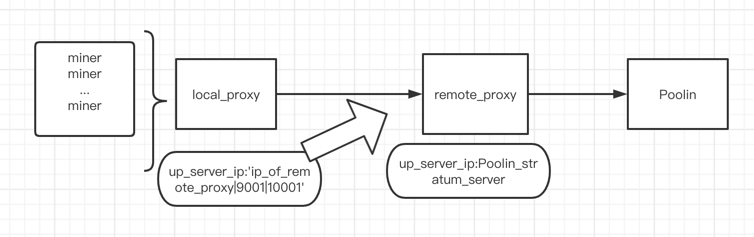

# Poolin 智能代理可以根据场地不同网络情况灵活部署

## 基本代理模式
```asm
基本模式即:
代理机器与矿机同处于局域网
矿机和代理机LAN网交互
代理机与Poolin服务器WAN交互

--Poolin服务器设置--
up_server_address
缺省值则默认到poolin全球负载均衡地址,会根据交互网络情况自动选取最优服务器进行连接

亦可根据自身需求向poolin索要多个固定域名或ip以","分隔成服务器地址列表
```


## 串联模式
```asm
多代理串联模式:
可根据自身网络交互要求进行部署

部署于场地内的代理机与远程代理机通过内部协议WAN交互
需要对up_server_address进行特别设置

场地内代理机:
up_server_address:ip_of_remote_proxy|9001|10001
9001和10001分别为remote_proxy的进出交互端口,需要remote_proxy机器对场地内代理机开放端口访问权限

remote_proxy代理机:
up_server_address:
可缺省或者poolin提供的服务器列表
```

